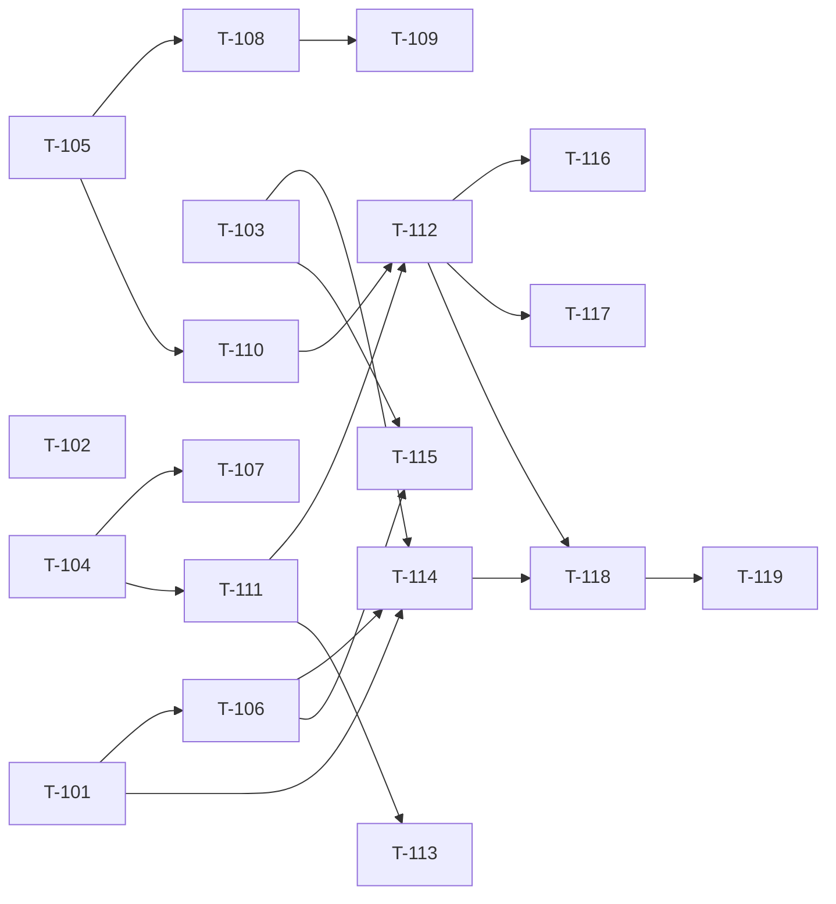

# Build Site: Dashboard Layout + Widget Palette Drag-Drop

Independent build site covering two cavekits:

- `cavekit-dashboard-layout.md` — R1..R6 (26 acceptance criteria)
- `cavekit-widget-palette-drag-drop.md` — R1..R7 (27 acceptance criteria)

T-numbering starts at **T-101** to avoid collision with the prior `build-site.md` (T-001..T-022, widgets-smashing-parity work).

This site does not redo any work tracked in `build-site.md`. Where prior commits already partially satisfy a requirement (notably layout R1 from commit `0216a27`), the task here is to **codify and lock** rather than reimplement.

---

## Tier 0 — No Dependencies (Start Here)

| Task | Title | Cavekit | Requirement | Effort |
|---|---|---|---|---|
| T-101 | Lock panel chrome CSS contract; remove standalone `min-height: 180px` rule | dashboard-layout | R1 | S |
| T-102 | Make `test/dummy` rebuild from engine migrations (no manual stamping) | dashboard-layout | R5 | S |
| T-103 | Add `Tiler.configuration.eager_panel_load`; wire test env; drop `5.times reload` workarounds | dashboard-layout | R6 | M |
| T-104 | Layout PATCH input validation in `dashboards_controller#layout` (clamp/reject/skip + structured errors) | dashboard-layout | R3 | M |
| T-105 | Add `default_config` and `default_size` class attrs to `Tiler::Widget` base class | palette | R2 | S |

---

## Tier 1 — Depends on Tier 0

| Task | Title | Cavekit | Requirement | blockedBy | Effort |
|---|---|---|---|---|---|
| T-106 | Add `text` widget to scroll allowlist via `.tiler-grid-stack .tiler-text` rule | dashboard-layout | R2 | T-101 | S |
| T-107 | Controller test for layout PATCH covering all six R3 branches | dashboard-layout | R3 | T-104 | S |
| T-108 | Per-widget `default_config` overrides for all 14 built-ins + parameterized unit test | palette | R2 | T-105 | M |
| T-109 | Defaults respect URL allowlist + enum whitelist + required-key states (unit tests) | palette | R6 | T-108 | S |
| T-110 | Palette UI markup, CSS, and edit-mode visibility toggle | palette | R1 | T-105 | M |
| T-111 | `panels#create` accepts `x/y/w/h/config` and returns Turbo Stream / JSON for drop flow | palette | R3 | T-104 | M |

---

## Tier 2 — Depends on Tier 1

| Task | Title | Cavekit | Requirement | blockedBy | Effort |
|---|---|---|---|---|---|
| T-112 | JS drop handler in `show.html.erb` (gridstack drag-in API → POST `panels#create`) | palette | R3 | T-110, T-111 | M |
| T-113 | Controller test: server rejects forged / blank `widget_type` (422) | palette | R5 | T-111 | S |
| T-114 | No-overflow regression smoke system test (every widget at `w=3, h=2`) | dashboard-layout | R4 | T-103, T-106 | M |
| T-115 | System test: opt-in scroll computed-style assertion per widget class | dashboard-layout | R2 | T-103, T-106 | S |

---

## Tier 3 — Depends on Tier 2

| Task | Title | Cavekit | Requirement | blockedBy | Effort |
|---|---|---|---|---|---|
| T-116 | System test: palette renders one tile per registered widget; edit-mode toggle hides | palette | R1 | T-112 | S |
| T-117 | System test: cancel-mid-drag (release outside grid) creates no panel, no ghost | palette | R4 | T-112 | S |
| T-118 | System test parameterized over every registered widget type: drop + render preview | palette | R7 | T-112, T-114 | M |
| T-119 | System tests: multi-drop, drop-then-move (PATCH layout fires), cancel coverage | palette | R7 | T-118 | M |

---

## Coverage Matrix

53 acceptance criteria total (26 layout + 27 palette). Every criterion maps to at least one task. No GAPs.

### cavekit-dashboard-layout.md

| Cavekit Req | AC# | Criterion (abbrev) | Task(s) | Status |
|---|---|---|---|---|
| R1 | AC1 | `.tiler-grid-stack .tiler-panel-body` has flex:1 1 auto, overflow:hidden, min-height:0, finite padding | T-101 | COVERED |
| R1 | AC2 | No positive `min-height` on `.tiler-panel-body` outside standalone scope; removing rule fails R4 test | T-101, T-114 | COVERED |
| R1 | AC3 | Panel header height reserved before body (`.tiler-grid-stack .tiler-panel` flex column) | T-101 | COVERED |
| R1 | AC4 | Tile right + bottom borders visible (body padding does not cover) | T-101 | COVERED |
| R2 | AC1 | Scroll allowlist: list, table, status_grid, text (text closes F-003) | T-106 | COVERED |
| R2 | AC2 | Clip (no scroll) widgets: clock, metric, number_with_delta, meter, image, comments, iframe, line_chart, bar_chart, pie_chart | T-101, T-106 | COVERED |
| R2 | AC3 | CSS opt-in expressed as one rule per widget content class (no inline JS / per-partial) | T-106 | COVERED |
| R2 | AC4 | System test asserts computed `overflow` per widget (auto/scroll vs hidden) | T-115 | COVERED |
| R3 | AC1 | PATCH `x = -100` rejected or clamped to 0; never persists `x<0` or `x>11` | T-104, T-107 | COVERED |
| R3 | AC2 | PATCH `y = -5` rejected or clamped to 0; never persists `y<0` | T-104, T-107 | COVERED |
| R3 | AC3 | PATCH `width = 0` or `width = 50` clamped to `1..12` | T-104, T-107 | COVERED |
| R3 | AC4 | PATCH non-array `items` returns 400 with JSON error body (not silent 200) | T-104, T-107 | COVERED |
| R3 | AC5 | PATCH items missing `id/x/y/w/h` keys: silently skipped per item; response indicates applied vs skipped | T-104, T-107 | COVERED |
| R3 | AC6 | Controller test covers each branch above | T-107 | COVERED |
| R4 | AC1 | System test seeds one panel of every registered widget type at `w=3, h=2` | T-114 | COVERED |
| R4 | AC2 | After turbo-frames render, asserts `scrollHeight <= clientHeight + 1` for non-allowlisted children | T-114 | COVERED |
| R4 | AC3 | Test fails if non-allowlisted widget overflows; passes if all clip-or-fit | T-114 | COVERED |
| R4 | AC4 | Reverting R1 grid-scoped rule (or re-adding `min-height: 180px`) causes test to fail | T-114 | COVERED |
| R5 | AC1 | `bin/rails db:drop db:create db:migrate` from `test/dummy` exits 0 | T-102 | COVERED |
| R5 | AC2 | After migrate, `Tiler.widgets.types` enumerable and `Tiler::Dashboard.create!(name: "X")` succeeds | T-102 | COVERED |
| R5 | AC3 | `bundle exec rails test` from engine root succeeds without pre-test SQL stamping | T-102 | COVERED |
| R5 | AC4 | `.github/workflows/ci.yml` contains no manual `INSERT INTO schema_migrations` workarounds | T-102 | COVERED |
| R6 | AC1 | `Tiler.configuration.eager_panel_load` flag (default false) controls turbo-frame `loading:` attr | T-103 | COVERED |
| R6 | AC2 | Test env sets the flag true (initializer in `test/dummy/config/environments/test.rb` or equivalent) | T-103 | COVERED |
| R6 | AC3 | Existing `5.times { reload }` workarounds drop the workaround or it becomes a no-op (still pass) | T-103 | COVERED |
| R6 | AC4 | At least two system tests are simplified by removing the `5.times reload` pattern | T-103 | COVERED |

### cavekit-widget-palette-drag-drop.md

| Cavekit Req | AC# | Criterion (abbrev) | Task(s) | Status |
|---|---|---|---|---|
| R1 | AC1 | When `.tiler-editing` on `.grid-stack`, `.tiler-widget-palette` is visible (not display:none) | T-110 | COVERED |
| R1 | AC2 | Edit mode off → palette is `display: none` (no layout shift) | T-110 | COVERED |
| R1 | AC3 | One `[data-tiler-palette-widget][data-widget-type=<type>]` per registered widget | T-110 | COVERED |
| R1 | AC4 | Each tile shows widget label and is draggable (`draggable=true` or gridstack drag-in) | T-110 | COVERED |
| R1 | AC5 | System test: edit mode on shows all widget types; toggling off hides | T-116 | COVERED |
| R2 | AC1 | `Tiler::Widget` base class exposes class-level `default_config` (`{}`) and `default_size` (`{w:6, h:2}`) | T-105 | COVERED |
| R2 | AC2 | Each built-in declares default_config that renders without raising (text/image/meter/comments specifics) | T-108 | COVERED |
| R2 | AC3 | Default configs MUST NOT violate R7 URL allowlist or R8 enum whitelist (no `fit:"stretch"`, no `aggregation:"sum_squared"`) | T-108, T-109 | COVERED |
| R2 | AC4 | Parameterized unit test: each widget's defaults call `panel.data` and render partial without raising | T-108 | COVERED |
| R3 | AC1 | JS drop handler reads `data-widget-type`, computes `x/y/w/h`, POSTs to existing endpoint with config JSON | T-112 | COVERED |
| R3 | AC2 | On 2xx, new panel turbo-frame rendered into dropped slot (Turbo Stream or full-frame replace) | T-111, T-112 | COVERED |
| R3 | AC3 | On non-2xx, dropped placeholder removed and flash error surfaced | T-112 | COVERED |
| R3 | AC4 | Server: panel persisted with widget_type, coords, config; passes existing model validations | T-111 | COVERED |
| R3 | AC5 | Drop coords clamped/validated by same rules as dashboard-layout R3 | T-104, T-111 | COVERED |
| R4 | AC1 | System test: drag tile, release outside `.grid-stack` → `Panel.count` unchanged, no ghost in DOM | T-117 | COVERED |
| R4 | AC2 | No POST fired during cancelled drag | T-117 | COVERED |
| R5 | AC1 | Controller test: POST `widget_type: "../etc/passwd"` returns 422, no panel | T-113 | COVERED |
| R5 | AC2 | Controller test: POST `widget_type: ""` returns 422, no panel | T-113 | COVERED |
| R5 | AC3 | Controller test: POST `widget_type: "image"` succeeds | T-113 | COVERED |
| R6 | AC1 | `Tiler.widgets["image"].default_config["url"]` absent or in allowed-scheme set; never `javascript:`/`data:`/`file:` | T-109 | COVERED |
| R6 | AC2 | `Tiler.widgets["meter"].default_config["aggregation"]` absent or in `%w[avg sum max min last]` | T-109 | COVERED |
| R6 | AC3 | Rendering panel from each widget's defaults does not raise and surfaces required-key placeholder where intended | T-108, T-109 | COVERED |
| R7 | AC1 | System test: drag clock tile to (0,0); one Panel persisted with widget_type=clock, x=0, y=0, default w/h | T-118 | COVERED |
| R7 | AC2 | System test parameterized over every widget type: drop and assert preview renders without server error | T-118 | COVERED |
| R7 | AC3 | System test: drop two tiles in quick succession; both persist with distinct ids and non-overlapping coords | T-119 | COVERED |
| R7 | AC4 | System test: drop tile, then drag resulting panel to new slot — PATCH layout fires and persists | T-119 | COVERED |
| R7 | AC5 | System test: cancel drag (drop outside grid) — no panel created (covers R4) | T-117, T-119 | COVERED |

**Coverage:** 53 / 53 = 100% COVERED. 0 GAPs.

---

## Dependency Graph

Same-tier tasks with no edges between them are parallelizable. Tier 0 has 5 fully independent starters (T-101, T-102, T-103, T-104, T-105) — five agents can work simultaneously.

---

## Implementation Sequence (Detail)

### Tier 0

#### T-101: Lock panel chrome CSS contract
**Cavekit Requirement:** dashboard-layout/R1
**Acceptance Criteria Mapped:** R1 AC1, AC2, AC3, AC4
**blockedBy:** none
**Effort:** S
**Description:**
- Confirm `app/assets/stylesheets/tiler/application.css` has the grid-scoped rule from commit `0216a27`: `.tiler-grid-stack .tiler-panel-body { flex: 1 1 auto; overflow: hidden; min-height: 0; padding: <finite>; }` and `.tiler-grid-stack .tiler-panel { display: flex; flex-direction: column; }`.
- Search the stylesheet for any `.tiler-panel-body { ... min-height: 180px ... }` rule that is NOT scoped under a standalone-only selector and delete it. If a standalone min-height is desired, scope it explicitly (e.g., `.tiler-panel-standalone .tiler-panel-body { min-height: 180px; }`).
- Verify body padding does not exceed the tile's reserved border space.
**Files:** `app/assets/stylesheets/tiler/application.css`
**Test Strategy:** Visual verification on dummy app. Locked in by T-114 (overflow regression test) which fails if the contract regresses.

#### T-102: Dummy app rebuilds from engine migrations
**Cavekit Requirement:** dashboard-layout/R5
**Acceptance Criteria Mapped:** R5 AC1, AC2, AC3, AC4
**blockedBy:** none
**Effort:** S
**Description:**
- Choose option (a) — append the engine migrate path in `test/dummy/config/application.rb` so dummy `db:migrate` picks up engine migrations: `config.paths['db/migrate'] += Dir[Rails.root.join('../../db/migrate').to_s]` (or equivalent). Alternative: option (b), copy/symlink engine migrations into `test/dummy/db/migrate/`.
- Confirm `bin/rails db:drop db:create db:migrate` from `test/dummy` exits 0 and `Tiler::Dashboard.create!(name: "X")` succeeds.
- Open `.github/workflows/ci.yml` and remove any manual `INSERT INTO schema_migrations` or hand-stamping steps; replace with a clean `bin/rails db:prepare` (or `db:migrate`) step.
**Files:** `test/dummy/config/application.rb`, `.github/workflows/ci.yml`, possibly `test/dummy/db/migrate/*` (if option b)
**Test Strategy:** `bin/rails db:drop db:create db:migrate` from `test/dummy`; `bundle exec rails test` from engine root; CI green.

#### T-103: Eager-load turbo-frame test mode
**Cavekit Requirement:** dashboard-layout/R6
**Acceptance Criteria Mapped:** R6 AC1, AC2, AC3, AC4
**blockedBy:** none
**Effort:** M
**Description:**
- Add `Tiler::Configuration#eager_panel_load` (default `false`); ensure `Tiler.configuration` accessor exists in `lib/tiler.rb` or `lib/tiler/engine.rb`.
- In the dashboard `show.html.erb` and any panel turbo-frame partials, set `loading: Tiler.configuration.eager_panel_load ? :eager : :lazy` on the turbo-frame tag.
- In `test/dummy/config/environments/test.rb`, add `Tiler.configure { |c| c.eager_panel_load = true }` (or equivalent initializer).
- Search `test/system/` for `5.times { ... reload }` (or `5.times do reload end`) patterns; remove from at least two tests and confirm they still pass.
**Files:** `lib/tiler/configuration.rb` (new or existing), `lib/tiler.rb`, `app/views/tiler/dashboards/show.html.erb`, `app/views/tiler/panels/*.erb` (turbo-frame tag), `test/dummy/config/environments/test.rb`, `test/system/*.rb`
**Test Strategy:** Run the simplified system tests headless; assert green without the workaround.

#### T-104: Layout PATCH input validation
**Cavekit Requirement:** dashboard-layout/R3
**Acceptance Criteria Mapped:** R3 AC1, AC2, AC3, AC4, AC5 (AC6 = T-107)
**blockedBy:** none
**Effort:** M
**Description:**
- In `app/controllers/tiler/dashboards_controller.rb#layout`, before iterating, type-check `params[:items]`. If not an Array, render `{ error: "items must be an array" }` with 400.
- For each item, require keys `id`, `x`, `y`, `w`, `h`. Items missing any are skipped; track `applied_count` and `skipped_count`.
- Clamp coordinates: `x = x.to_i.clamp(0, 11)`, `y = [y.to_i, 0].max`, `w = w.to_i.clamp(1, 12)`, `h = h.to_i.clamp(1, 12)` before update.
- Response body on success: `{ applied: <n>, skipped: <m> }`.
**Files:** `app/controllers/tiler/dashboards_controller.rb`
**Test Strategy:** Covered by T-107.

#### T-105: Widget base class default_config + default_size
**Cavekit Requirement:** palette/R2
**Acceptance Criteria Mapped:** R2 AC1
**blockedBy:** none
**Effort:** S
**Description:**
- In `lib/tiler/widget.rb` (or wherever `Tiler::Widget` is defined), add `class_attribute :default_config, default: {}` and `class_attribute :default_size, default: { w: 6, h: 2 }` (or equivalent class-level DSL `def self.default_config; {}; end` overridable in subclasses).
- Ensure these attributes are exposed on widget classes accessible via `Tiler.widgets[type]`.
**Files:** `lib/tiler/widget.rb` (or base class location — confirm in `lib/tiler/widgets/*` references)
**Test Strategy:** `Tiler::Widget.default_config == {}` and `Tiler::Widget.default_size == {w:6, h:2}` in a unit test (rolled into T-108's parameterized suite).

### Tier 1

#### T-106: Add `text` to scroll allowlist
**Cavekit Requirement:** dashboard-layout/R2
**Acceptance Criteria Mapped:** R2 AC1, AC2 (text portion), AC3
**blockedBy:** T-101
**Effort:** S
**Description:**
- In `app/assets/stylesheets/tiler/application.css`, the existing allowlist rules look like `.tiler-grid-stack .tiler-list { max-height: 100%; overflow: auto; }` (and `.tiler-table`, `.tiler-status-grid`). Add `.tiler-grid-stack .tiler-text { max-height: 100%; overflow: auto; }`.
- Confirm the text partial root element carries the `tiler-text` class.
- Do NOT add per-partial inline styles or JS toggles — must be a pure CSS rule.
**Files:** `app/assets/stylesheets/tiler/application.css`, `app/views/tiler/widgets/_text.html.erb` (verify class)
**Test Strategy:** Covered by T-115 (computed-style assertion).

#### T-107: Layout PATCH controller test
**Cavekit Requirement:** dashboard-layout/R3
**Acceptance Criteria Mapped:** R3 AC6 (and validates AC1–AC5)
**blockedBy:** T-104
**Effort:** S
**Description:** Add `test/controllers/tiler/dashboards_controller_test.rb` (or extend existing) with cases:
- PATCH with `items: [{id:, x:-100, y:0, w:1, h:1}]` → asserts saved row x == 0.
- PATCH with `y:-5` → asserts saved row y == 0.
- PATCH with `w: 0` and `w: 50` → asserts saved row w in `1..12`.
- PATCH with `items: {}` → asserts response status 400, JSON body has `error`.
- PATCH with `items: "foo"` → asserts 400.
- PATCH with `items: [{id:}, {id:, x:, y:, w:, h:}]` (one missing keys) → asserts response indicates `applied: 1, skipped: 1`.
**Files:** `test/controllers/tiler/dashboards_controller_test.rb`
**Test Strategy:** `bundle exec rails test test/controllers/tiler/dashboards_controller_test.rb`.

#### T-108: Per-widget defaults + parameterized unit test
**Cavekit Requirement:** palette/R2
**Acceptance Criteria Mapped:** R2 AC2, AC3, AC4
**blockedBy:** T-105
**Effort:** M
**Description:** In each `lib/tiler/widgets/<name>.rb`, override `default_config` and (where useful) `default_size`:
- `clock`: `{}` (trivial), default size OK.
- `text`: `{ "text" => "Edit me", "size" => "md" }`.
- `iframe`: `{}` (no default URL — partial shows placeholder).
- `image`: `{}` (no default URL — partial shows "No image URL configured").
- `comments`: `{}` (no default `quote_column` — partial shows "No comments yet.").
- `meter`: `{}` (no default `max` — partial shows "Configure max").
- `metric`, `number_with_delta`: `{}` or minimal label keys — confirm partial does not raise.
- `list`, `table`, `pie_chart`, `bar_chart`, `line_chart`, `status_grid`: `{}` defaults; default_size may bump to `{w: 6, h: 3}` for chart-y widgets.
- Forbidden values: NEVER include `fit: "stretch"` (enum violation per smashing-parity R8) or `aggregation: "sum_squared"`. Default `aggregation` either omitted (falls back to `last`) or in `%w[avg sum max min last]`.
- Add `test/lib/tiler/widget_defaults_test.rb` parameterized over `Tiler.widgets.types`: for each type, build a `Panel.new(widget_type: t, config: klass.default_config, width: klass.default_size[:w], height: klass.default_size[:h])`, call `panel.data`, render the partial with `ActionController::Base.new.render_to_string(partial: "tiler/widgets/#{t}", locals: {panel: panel})` — assert no exception.
**Files:** All `lib/tiler/widgets/*.rb`, new `test/lib/tiler/widget_defaults_test.rb`
**Test Strategy:** `bundle exec rails test test/lib/tiler/widget_defaults_test.rb`.

#### T-109: Defaults respect security/validation kits
**Cavekit Requirement:** palette/R6
**Acceptance Criteria Mapped:** R6 AC1, AC2, AC3
**blockedBy:** T-108
**Effort:** S
**Description:** Extend `test/lib/tiler/widget_defaults_test.rb` (or add `test/lib/tiler/widget_defaults_security_test.rb`):
- For `Tiler.widgets["image"]`: `default_config["url"]` is `nil` OR matches the allowed URL scheme regex (per smashing-parity R7). Fail if it starts with `javascript:`, `data:`, or `file:`.
- For `Tiler.widgets["meter"]`: `default_config["aggregation"]` is `nil` OR in `%w[avg sum max min last]`.
- Render-without-raise assertions also confirm the required-key placeholders surface (per smashing-parity R9) — assert the rendered HTML includes "No image URL configured" / "Configure max" / "No comments yet." for those widgets.
**Files:** `test/lib/tiler/widget_defaults_test.rb` (or new test file)
**Test Strategy:** Same test command as T-108.

#### T-110: Palette UI markup, CSS, and edit-mode toggle
**Cavekit Requirement:** palette/R1
**Acceptance Criteria Mapped:** R1 AC1, AC2, AC3, AC4
**blockedBy:** T-105
**Effort:** M
**Description:**
- In `app/views/tiler/dashboards/show.html.erb`, render a sidebar `<aside class="tiler-widget-palette">` BEFORE the grid container. Inside, iterate `Tiler.widgets.types` (or `Tiler.widgets.values`) and emit `
" draggable="true">…<%= klass.label %>…
` per widget.
- In `app/assets/stylesheets/tiler/application.css`, add `.tiler-widget-palette { display: none; }` and `.tiler-editing + .tiler-widget-palette, .tiler-editing .tiler-widget-palette, .tiler-widget-palette.tiler-editing { display: <flex|grid>; }` — pick the selector that matches how `.tiler-editing` is toggled in the existing edit-mode JS (search `show.html.erb` for the edit-mode toggle).
- Wire each tile via gridstack's drag-in API in the JS (see existing `GridStack.init` block in `show.html.erb`). The actual drop handler is T-112; this task provides the draggable tiles only.
**Files:** `app/views/tiler/dashboards/show.html.erb`, `app/assets/stylesheets/tiler/application.css`, possibly `app/views/tiler/dashboards/_palette.html.erb` (extracted partial)
**Design Ref:** `DESIGN.md` (if present) section on edit-mode chrome — palette is a left sidebar element, not modal.
**Test Strategy:** Covered by T-116 (system test).

#### T-111: panels#create accepts drop payload + Turbo Stream response
**Cavekit Requirement:** palette/R3
**Acceptance Criteria Mapped:** R3 AC2, AC4, AC5
**blockedBy:** T-104
**Effort:** M
**Description:**
- In `app/controllers/tiler/panels_controller.rb#create`, confirm strong params include `:x, :y, :width, :height, :widget_type, :title, config: {}`. Add any missing keys.
- Apply the same clamp logic as T-104's R3 contract to the supplied coords (or extract a shared helper / model-level callback).
- Respond to `format.turbo_stream` with a `turbo_stream.replace` (or `append`) targeting the dropped placeholder slot, rendering the new panel's preview frame.
- Respond to `format.json` with `{ id:, html: render_to_string(...) }` as a fallback.
- On invalid record, render 422 with the validation errors.
**Files:** `app/controllers/tiler/panels_controller.rb`, `app/views/tiler/panels/create.turbo_stream.erb` (new)
**Test Strategy:** Drop-flow controller test (folded into T-113 + T-118 system test). Validate JSON + Turbo Stream branches via request specs.

### Tier 2

#### T-112: JS drop handler in show.html.erb
**Cavekit Requirement:** palette/R3
**Acceptance Criteria Mapped:** R3 AC1, AC2, AC3
**blockedBy:** T-110, T-111
**Effort:** M
**Description:**
- In the gridstack init block in `app/views/tiler/dashboards/show.html.erb`, register `[data-tiler-palette-widget]` as a drag-in source via `GridStack.setupDragIn(...)` (gridstack v8+ API).
- Listen for the `added` event on the grid: when the added node has `data-widget-type`, fire `fetch(panelsCreateUrl, { method: 'POST', body: FormData(...) })` with `panel[widget_type]`, `panel[title]` (default to widget label), `panel[width|height|x|y]`, `panel[config]` (JSON-stringified `klass.default_config`, exposed via a hidden data-attr on the palette tile).
- On 2xx Turbo Stream response, let Turbo replace the placeholder with the rendered panel frame. On non-2xx, remove the gridstack node and dispatch a flash message (reuse existing flash infra).
- Pass CSRF token from the meta tag.
**Files:** `app/views/tiler/dashboards/show.html.erb` (or extract `app/javascript/tiler/palette_drop.js` / inline `<script>`)
**Test Strategy:** Covered by T-118 system tests.

#### T-113: Server rejects forged widget_type
**Cavekit Requirement:** palette/R5
**Acceptance Criteria Mapped:** R5 AC1, AC2, AC3
**blockedBy:** T-111
**Effort:** S
**Description:** Add `test/controllers/tiler/panels_controller_test.rb` cases:
- POST with `panel[widget_type]: "../etc/passwd"` → assert `response.status == 422`, `Tiler::Panel.count` unchanged.
- POST with `panel[widget_type]: ""` → assert 422.
- POST with `panel[widget_type]: "image"` plus minimal valid params → assert 2xx and panel persisted.
- Verify the validation lives at the model level (`validates :widget_type, inclusion: { in: -> { Tiler.widgets.types } }`) — if missing, add it.
**Files:** `test/controllers/tiler/panels_controller_test.rb`, possibly `app/models/tiler/panel.rb`
**Test Strategy:** `bundle exec rails test test/controllers/tiler/panels_controller_test.rb`.

#### T-114: No-overflow regression smoke test
**Cavekit Requirement:** dashboard-layout/R4
**Acceptance Criteria Mapped:** R4 AC1, AC2, AC3, AC4
**blockedBy:** T-103, T-106
**Effort:** M
**Description:** Add `test/system/panel_overflow_test.rb`:
- In setup, create a `Tiler::Dashboard` and one `Tiler::Panel` per `Tiler.widgets.types` at `width: 3, height: 2` with each widget's `default_config`.
- Visit the dashboard show; with eager-load (T-103) the turbo-frames render synchronously.
- In JS via `page.execute_script` / `evaluate_script`, iterate `document.querySelectorAll('.grid-stack-item-content')`. For each child element representing a widget partial, classify by the widget's class — if NOT in the allowlist (`tiler-list`, `tiler-table`, `tiler-status-grid`, `tiler-text`), assert `child.scrollHeight <= child.clientHeight + 1`.
- Document AC4 explicitly: a comment in the test references the exact CSS lines protected (T-101's grid-scoped rule).
**Files:** `test/system/panel_overflow_test.rb`
**Test Strategy:** `bundle exec rails test:system test/system/panel_overflow_test.rb`. Manual verification: re-add `min-height: 180px` locally and confirm test fails.

#### T-115: Computed-style assertion per widget class
**Cavekit Requirement:** dashboard-layout/R2
**Acceptance Criteria Mapped:** R2 AC4
**blockedBy:** T-103, T-106
**Effort:** S
**Description:** Add `test/system/panel_scroll_allowlist_test.rb`:
- Seed one panel per registered widget type with a config that produces overflow content (long list, long table rows, long text paragraphs).
- For each panel, evaluate `getComputedStyle(document.querySelector('.tiler-grid-stack .tiler-<type>')).overflow`.
- Allowlist (`list`, `table`, `status_grid`, `text`) → assert returns `"auto"` or `"scroll"`.
- Others → assert returns `"hidden"` (or `"visible"` rolling up to body's `overflow: hidden` — check the kit's intent and resolve to whatever the body clip enforces).
**Files:** `test/system/panel_scroll_allowlist_test.rb`
**Test Strategy:** `bundle exec rails test:system test/system/panel_scroll_allowlist_test.rb`.

### Tier 3

#### T-116: Palette UI system test
**Cavekit Requirement:** palette/R1
**Acceptance Criteria Mapped:** R1 AC5
**blockedBy:** T-112
**Effort:** S
**Description:** Add `test/system/palette_visibility_test.rb`:
- Visit dashboard show in edit mode (toggle on programmatically or click the edit-mode button).
- Assert `[data-tiler-palette-widget]` exists for every `Tiler.widgets.types` value.
- Assert palette is visible (`page.has_css?('.tiler-widget-palette:not([style*="display: none"])')`).
- Toggle edit mode off; assert palette is hidden.
**Files:** `test/system/palette_visibility_test.rb`
**Test Strategy:** `bundle exec rails test:system test/system/palette_visibility_test.rb`.

#### T-117: Cancel-mid-drag system test
**Cavekit Requirement:** palette/R4
**Acceptance Criteria Mapped:** R4 AC1, AC2
**blockedBy:** T-112
**Effort:** S
**Description:** Add `test/system/palette_cancel_drag_test.rb`:
- Capture `Tiler::Panel.count` before drag.
- Use `page.driver.browser.execute_cdp` or capybara native drag (`source.drag_to(target)`) to start a drag from a palette tile and release outside `.grid-stack` (e.g., release on the `<body>` background).
- Assert `Tiler::Panel.count` unchanged.
- Assert `page.has_no_css?('[data-tiler-palette-ghost]')`.
- Assert no POST was sent (capture via a request-counter middleware in test env, or rely on count assertion).
**Files:** `test/system/palette_cancel_drag_test.rb`
**Test Strategy:** `bundle exec rails test:system test/system/palette_cancel_drag_test.rb`.

#### T-118: Parameterized drop tests for every widget type
**Cavekit Requirement:** palette/R7
**Acceptance Criteria Mapped:** R7 AC1, AC2
**blockedBy:** T-112, T-114
**Effort:** M
**Description:** Add `test/system/palette_drop_test.rb`:
- For each `Tiler.widgets.types` value (driven by a loop generating one test method per type), visit a fresh dashboard, enable edit mode, and via `page.execute_script` invoke `grid.addWidget({ x:0, y:0, w: defaultW, h: defaultH, content: '
">
' })` to mirror gridstack's drag-in callback (the headless-Chrome-friendly pattern from `dashboard_flow_test.rb`).
- Wait for the Turbo Stream response; assert one new `Tiler::Panel` exists with the expected `widget_type`, `x: 0`, `y: 0`, and the widget's default size.
- Assert the rendered panel preview does NOT contain the server-error frame (`.tiler-panel-error`) — if a widget's default partial raises, this test catches it.
- Use the `clock` widget for the explicit `(0,0)` happy-path check (R7 AC1).
**Files:** `test/system/palette_drop_test.rb`
**Test Strategy:** `bundle exec rails test:system test/system/palette_drop_test.rb`.

#### T-119: Multi-drop + drop-then-move + cancel coverage
**Cavekit Requirement:** palette/R7
**Acceptance Criteria Mapped:** R7 AC3, AC4, AC5
**blockedBy:** T-118
**Effort:** M
**Description:** Extend `test/system/palette_drop_test.rb` (or add `test/system/palette_drop_advanced_test.rb`):
- **Multi-drop:** drop two tiles in quick succession (back-to-back JS calls); assert two distinct `Tiler::Panel` rows persist with non-overlapping coords.
- **Drop-then-move:** drop a tile, then via `grid.move(...)` simulate the user dragging the resulting panel to a new slot; assert the layout PATCH endpoint is hit (verify via captured request logs or new persisted x/y in DB).
- **Cancel coverage:** include or cross-reference T-117 to satisfy R7 AC5 explicitly.
**Files:** `test/system/palette_drop_test.rb` or `test/system/palette_drop_advanced_test.rb`
**Test Strategy:** `bundle exec rails test:system`.

---

## Summary

| Metric | Count |
|---|---|
| Total tasks | 19 |
| Tier 0 (no deps) | 5 |
| Tier 1 | 6 |
| Tier 2 | 4 |
| Tier 3 | 4 |
| Cavekits covered | 2 |
| Requirements covered | 13 (6 + 7) |
| Acceptance criteria covered | 53 / 53 (100%) |
| Effort distribution | S: 11, M: 8, L: 0 |
| Conditional / dynamic tasks | 0 |

---

## Architect Report

### Coverage
- All 53 acceptance criteria across both kits are mapped. Zero GAPs. Several criteria (notably R3 AC1–AC5 in dashboard-layout, R3 AC1–AC5 in palette) are co-covered by an implementation task and a verifying test task — this is intentional separation so a controller change and its assertion-bearing test can be reviewed independently.

### Dependency shape
- Tier 0 has 5 fully independent starters; the build can fan out to 5 parallel agents on day 1.
- The narrowest neck is at T-112 (JS drop handler), which is the linchpin for all Tier 3 system tests. T-112 itself has only two prerequisites (T-110 palette tiles + T-111 server endpoint) and both are tier 1.
- T-114 (overflow regression smoke) is wisely positioned before T-118 (drop-and-render-each-widget) so that any rendering-overflow failures surface in a focused single-purpose test before the higher-noise drop suite.

### Risk hotspots
- **T-103 (eager-load mode)** changes the default test-environment turbo-frame loading attribute. The required "drop at least two `5.times reload` workarounds" check forces verification that previously flaky tests are now structurally clean. If the existing tests still pass without simplification, that is suspicious — likely the workaround was masking a real race.
- **T-104 (PATCH validation)** changes a behavior contract — payloads that used to silently 200 will now 400 (per AC4). Any existing JS that relied on the silent-success behavior must be updated. Audit `show.html.erb` JS for `fetch(layoutUrl)` callers; T-112's drop flow uses `panels#create` rather than `dashboards#layout`, so they're separate concerns, but drag-resize on existing panels does hit `dashboards#layout` and must be re-verified post-T-104.
- **T-108 (per-widget defaults)** must be very careful with `meter`'s default_config — the kit explicitly forbids setting a default `max` (because a silently-zero meter is misleading per F-004). The unit test must assert `default_config.key?("max") == false` for meter, and the placeholder branch must render.
- **T-112 (JS drop handler)** depends on which gridstack version the engine vendors. The drag-in API differs between v7 and v8. Confirm version in `app/assets/javascripts/tiler/` or the gem manifest before writing the handler. If gridstack < v8, the `setupDragIn` API may not exist and a manual `dragstart`/`drop` event chain may be required.

### Cross-kit dependencies (external to this site)
- This site assumes the prior `build-site.md` (T-001..T-022) has shipped — specifically the security/validation kit work (smashing-parity R7 URL allowlist, R8 enum whitelist, R9 required-key states) that T-109 references and that T-108's defaults must respect.
- If smashing-parity R6–R10 have NOT shipped, T-109 should be deferred and a P1 known-issue raised. Confirm against `impl/` tracking before kicking off Tier 1.

### Suggested execution
1. Start parallel: T-101, T-102, T-103, T-104, T-105 (one agent each, all S/M).
2. Once Tier 0 settles: parallel T-106, T-107, T-108, T-110, T-111. T-109 follows T-108.
3. T-112 + T-113 + T-114 + T-115 in Tier 2.
4. Tier 3 system tests fan out: T-116, T-117, T-118 in parallel; T-119 after T-118.

### Out of scope (intentionally not planned)
- Custom widget icons or thumbnails in palette tiles (kit explicitly excludes).
- Touch / mobile drag semantics beyond gridstack defaults.
- Inline-edit form auto-opening on drop.
- Cross-dashboard drag-from-palette transfers.
- Replacing gridstack with another grid library.
