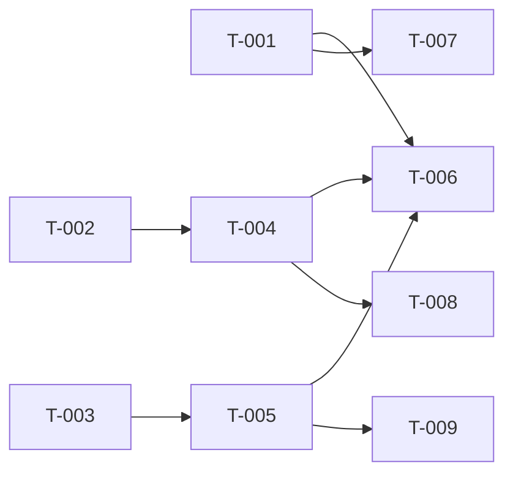

# Build Site: Tiler Smashing-Parity Widget Expansion

Concrete, framework-specific implementation plan for `cavekit-widgets-smashing-parity.md`. The kit defines five requirements (R1 image, R2 meter, R3 comments, R4 engine + seed wiring, R5 tests) totaling 41 acceptance criteria. This build site decomposes the work into nine Tier-ordered tasks with explicit dependencies, an exhaustive coverage matrix, and a Mermaid dependency diagram.

## Source Kits

- `cavekit-widgets-smashing-parity.md`: R1, R2, R3, R4, R5

## Project Context

- Rails engine root: `/Users/augustingottlieb/tiler`
- Widget classes: `/Users/augustingottlieb/tiler/lib/tiler/widgets/<name>.rb`
- Widget partials: `/Users/augustingottlieb/tiler/app/views/tiler/widgets/_<name>.html.erb`
- Engine auto-load (initializer `tiler.register_builtin_widgets`): `/Users/augustingottlieb/tiler/lib/tiler/engine.rb`
- Seed task `tiler:seed`: `/Users/augustingottlieb/tiler/lib/tasks/tiler_tasks.rake`
- Widget tests: `/Users/augustingottlieb/tiler/test/lib/tiler/widgets/` (new directory)
- Test runner: `bundle exec rails test` from `/Users/augustingottlieb/tiler/test/dummy`

## Tier 0 — No Dependencies (Parallel-Runnable)

| Task  | Title                                | Cavekit                            | Requirement | Effort |
|-------|--------------------------------------|------------------------------------|-------------|--------|
| T-001 | Image widget class + partial         | widgets-smashing-parity            | R1          | S      |
| T-002 | Meter query class                    | widgets-smashing-parity            | R2          | M      |
| T-003 | Comments query class                 | widgets-smashing-parity            | R3          | M      |

### T-001: Image widget class + partial
**Cavekit Requirement:** widgets-smashing-parity/R1
**Acceptance Criteria Mapped:** R1-AC1, R1-AC2, R1-AC3, R1-AC4, R1-AC5, R1-AC6, R1-AC7
**blockedBy:** none
**Effort:** S
**Description:**
1. Create `/Users/augustingottlieb/tiler/lib/tiler/widgets/image.rb`:
   - Subclass `Tiler::Widget`.
   - Set `self.type = "image"`, `self.label = "Image"`, `self.partial = "tiler/widgets/image"`, `self.query_class = nil`.
   - Implement `#data` reading `panel.config` (parsed JSON) and returning a hash `{ url:, alt:, fit: }`.
   - Default `fit` to `"contain"` when missing or blank; pass `url`/`alt` through verbatim.
   - Self-register: `Tiler.widgets.register(self)` at the bottom of the file.
2. Create `/Users/augustingottlieb/tiler/app/views/tiler/widgets/_image.html.erb`:
   - Receive locals `panel:` and `data:`.
   - When `data[:url]` is blank: render a `<p class="tiler-muted">` placeholder; render zero `` tags.
   - When `data[:url]` is present: render exactly one `` tag with `src=data[:url]`, `alt=data[:alt].to_s`, and an `object-fit` style or class derived from `data[:fit]` (e.g., `style="object-fit: <%= data[:fit] %>"` or `class="tiler-image-fit-<%= data[:fit] %>"`).
**Files:**
- `/Users/augustingottlieb/tiler/lib/tiler/widgets/image.rb` (new)
- `/Users/augustingottlieb/tiler/app/views/tiler/widgets/_image.html.erb` (new)
**Test Strategy:** Validated by T-007 (image_test.rb). Mechanical-tier; 5-minute time guard.

---

### T-002: Meter query class
**Cavekit Requirement:** widgets-smashing-parity/R2
**Acceptance Criteria Mapped:** R2-AC2, R2-AC3, R2-AC4, R2-AC5, R2-AC6 (data shape + aggregation contract)
**blockedBy:** none
**Effort:** M
**Description:**
1. Create `/Users/augustingottlieb/tiler/lib/tiler/widgets/meter.rb`:
   - Subclass `Tiler::Widget`. Set `type = "meter"`, `label = "Meter"`, `partial = "tiler/widgets/meter"`, `query_class = Meter::Query`.
2. Define nested `Meter::Query < Tiler::Query::Base`:
   - Read `value_column`, `aggregation` (default `"last"`), `time_window` (default `"24h"`), `min` (default `0`), `max` (required), `prefix`, `suffix` from `panel.config`.
   - Use existing `Tiler::Query::Base` time-window parser and aggregation helpers (mirrors `metric` / `number_with_delta`); confirm `:last` returns the value from the most recent `recorded_at` record.
   - Compute aggregate over filtered records; clamp into `[min, max]` (values < min → min; values > max → max).
   - Return exactly `{ value:, min:, max:, prefix:, suffix: }` — five keys, no extras.
   - Empty-result branch: return `{ value: min (or nil), min:, max:, prefix:, suffix: }` without raising.
3. Self-register: `Tiler.widgets.register(self)` at the bottom of `meter.rb`.
**Files:**
- `/Users/augustingottlieb/tiler/lib/tiler/widgets/meter.rb` (new — class + nested query)
**Test Strategy:** Validated by T-008. Investigation-tier (must verify `Tiler::Query::Base` exposes `last`); 15-minute time guard.

---

### T-003: Comments query class
**Cavekit Requirement:** widgets-smashing-parity/R3
**Acceptance Criteria Mapped:** R3-AC2, R3-AC3, R3-AC4, R3-AC5, R3-AC6, R3-AC7, R3-AC8
**blockedBy:** none
**Effort:** M
**Description:**
1. Create `/Users/augustingottlieb/tiler/lib/tiler/widgets/comments.rb`:
   - Subclass `Tiler::Widget`. Set `type = "comments"`, `label = "Comments"`, `partial = "tiler/widgets/comments"`, `query_class = Comments::Query`.
2. Define nested `Comments::Query < Tiler::Query::Base`:
   - Read `quote_column` (required), `name_column`, `avatar_column`, `time_window` (default `"7d"`), `limit` (default `10`, clamp to a sane upper bound such as `100`), `rotate_seconds` (default `8`, must be a positive integer).
   - Filter records by time window, order by `recorded_at DESC`, take `limit`.
   - Map each record to `{ quote:, name:, avatar: }` — exactly those three keys. When `name_column` / `avatar_column` is missing from config or absent on the payload, set the corresponding value to `nil` (do not raise).
   - Return `{ items: [...], rotate_seconds: <int> }` with at least those two keys; empty result returns `{ items: [], rotate_seconds: <int> }`.
3. Self-register: `Tiler.widgets.register(self)` at the bottom of `comments.rb`.
**Files:**
- `/Users/augustingottlieb/tiler/lib/tiler/widgets/comments.rb` (new — class + nested query)
**Test Strategy:** Validated by T-009. Investigation-tier; 15-minute time guard.

## Tier 1 — Depends on Tier 0

| Task  | Title                            | Cavekit                  | Requirement | blockedBy | Effort |
|-------|----------------------------------|--------------------------|-------------|-----------|--------|
| T-004 | Meter partial (SVG gauge)        | widgets-smashing-parity  | R2          | T-002     | M      |
| T-005 | Comments partial + Stimulus rotator | widgets-smashing-parity | R3        | T-003     | M      |

### T-004: Meter partial (SVG gauge)
**Cavekit Requirement:** widgets-smashing-parity/R2
**Acceptance Criteria Mapped:** R2-AC7, R2-AC8, R2-AC9
**blockedBy:** T-002
**Effort:** M
**Description:**
1. Create `/Users/augustingottlieb/tiler/app/views/tiler/widgets/_meter.html.erb`:
   - Locals `panel:` and `data:` (the five-key hash from T-002).
   - Render an `<svg>` element containing the gauge arc geometry. Compute the arc sweep angle as a function of `(data[:value] - data[:min]) / (data[:max] - data[:min])` so that `value == min` and `value == max` produce visibly different SVG path/transform output (different `d` attribute, `stroke-dasharray`, or arc rotation).
   - Render the formatted value text immediately surrounded by `data[:prefix]` and `data[:suffix]` with no intervening characters; when prefix/suffix is blank, emit nothing extra.
   - Tolerate `data[:value]` being `nil` (empty data source) without raising — fall back to `min` for arc geometry, render placeholder text or empty value display.
**Files:**
- `/Users/augustingottlieb/tiler/app/views/tiler/widgets/_meter.html.erb` (new)
**Test Strategy:** Validated by T-008 (SVG presence, prefix/suffix adjacency, min vs max markup divergence). 15-minute time guard.

---

### T-005: Comments partial + Stimulus rotator
**Cavekit Requirement:** widgets-smashing-parity/R3
**Acceptance Criteria Mapped:** R3-AC9, R3-AC10, R3-AC11
**blockedBy:** T-003
**Effort:** M
**Description:**
1. Create `/Users/augustingottlieb/tiler/app/views/tiler/widgets/_comments.html.erb`:
   - Locals `panel:` and `data:` (`{ items:, rotate_seconds: }` from T-003).
   - Root element wires up a Stimulus controller (e.g., `data-controller="tiler--comments-rotator"`) and exposes the rotation interval via `data-tiler--comments-rotator-interval-value="<%= data[:rotate_seconds] %>"` (or matching attribute name pattern already used by other Tiler Stimulus controllers).
   - Render every item in the DOM (rotation is purely client-side cycling over already-loaded markup) — every quote text appears in the output.
   - For each item: render the quote always; conditionally render the author-name node only when `:name` present (omit or render empty otherwise); conditionally render the `` avatar only when `:avatar` present (omit or substitute a default avatar element otherwise). No branch raises.
2. Create the Stimulus controller (location follows existing Tiler convention — likely `/Users/augustingottlieb/tiler/app/javascript/controllers/tiler/comments_rotator_controller.js` or registered through the engine's existing Stimulus loader). The controller cycles the `aria-current` / display state of items every `interval` seconds. If a single shared "rotator" controller already exists in the engine, reuse it instead of creating a new one.
**Files:**
- `/Users/augustingottlieb/tiler/app/views/tiler/widgets/_comments.html.erb` (new)
- Stimulus controller file under existing `app/javascript/controllers/...` path (new or reused)
**Test Strategy:** Validated by T-009 (all quotes in DOM, data attribute equals `rotate_seconds`, missing-name / missing-avatar branches do not raise). 15-minute time guard.

## Tier 2 — Depends on Tier 1

| Task  | Title                                | Cavekit                  | Requirement | blockedBy           | Effort |
|-------|--------------------------------------|--------------------------|-------------|---------------------|--------|
| T-006 | Engine registration + seed wiring    | widgets-smashing-parity  | R4          | T-001, T-004, T-005 | S      |

### T-006: Engine registration + seed wiring
**Cavekit Requirement:** widgets-smashing-parity/R4
**Acceptance Criteria Mapped:** R4-AC1, R4-AC2, R4-AC3, R4-AC4, R4-AC5, R4-AC6
**blockedBy:** T-001, T-004, T-005
**Effort:** S
**Description:**
1. Edit `/Users/augustingottlieb/tiler/lib/tiler/engine.rb`:
   - Inside the `tiler.register_builtin_widgets` initializer, add `require "tiler/widgets/image"`, `require "tiler/widgets/meter"`, `require "tiler/widgets/comments"` alongside the existing requires.
2. Edit `/Users/augustingottlieb/tiler/lib/tasks/tiler_tasks.rake`:
   - In the `tiler:seed` task, when the `demo` dashboard has no panels, create three additional panel rows (in addition to the pre-existing seeded panels):
     - `widget_type: "image"`, `data_source: nil`, `config: { url: "<non-blank URL>", alt: "...", fit: "contain" }`.
     - `widget_type: "meter"`, `data_source: <demo_requests>`, `config: { value_column: "...", max: <num>, time_window: "24h", aggregation: "avg" }` (include `value_column`, `max`, `time_window` at minimum).
     - `widget_type: "comments"`, `data_source: <demo_requests>`, `config: { quote_column: "...", time_window: "7d" }` (include `quote_column` and `time_window` at minimum).
   - Assign non-overlapping `x`, `y`, `width`, `height` grid coords on the existing 12-column layout; do not collide with any pre-existing seeded panel.
3. Confirm no new database migrations are added (configuration lives in the existing `tiler_panels.config` JSON column).
4. Smoke check: from `/Users/augustingottlieb/tiler/test/dummy`, `bin/rails db:reset && bin/rails tiler:seed && bin/rails server` (or equivalent), then `curl -I http://localhost:PORT/tiler/dashboards/demo` should return `HTTP/1.1 200` with no exceptions in the log.
**Files:**
- `/Users/augustingottlieb/tiler/lib/tiler/engine.rb` (modify)
- `/Users/augustingottlieb/tiler/lib/tasks/tiler_tasks.rake` (modify)
**Test Strategy:** Boot Rails console after change and assert `Tiler.widgets.all.map(&:type)` includes `"image"`, `"meter"`, `"comments"`. Run the seed task on a fresh dummy DB and `curl` the demo dashboard. R1-AC8, R2-AC10, R3-AC12 (dropdown visibility) follow automatically from R4-AC2 because the panel form is populated from `Tiler.widgets.all`. 5-minute time guard for the file edits; 15 minutes for the smoke check.

## Tier 3 — Depends on widget existing

| Task  | Title                  | Cavekit                  | Requirement | blockedBy | Effort |
|-------|------------------------|--------------------------|-------------|-----------|--------|
| T-007 | Image widget tests     | widgets-smashing-parity  | R5          | T-001     | S      |
| T-008 | Meter widget tests     | widgets-smashing-parity  | R5          | T-004     | M      |
| T-009 | Comments widget tests  | widgets-smashing-parity  | R5          | T-005     | M      |

Tier 3 tasks exercise widget classes and partials directly; they do not require T-006 because they instantiate widgets via `Tiler.widgets.lookup` after explicitly `require`-ing the widget file under test (Tier 0/1 tasks already self-register on require). Tier 3 still implicitly validates the dropdown-population criteria from R1/R2/R3 via registry lookup.

### T-007: Image widget tests
**Cavekit Requirement:** widgets-smashing-parity/R5
**Acceptance Criteria Mapped:** R1-AC1, R1-AC2, R1-AC3, R1-AC4, R1-AC5, R1-AC6, R1-AC7, R1-AC8, R5-AC1 (image), R5-AC2, R5-AC4, R5-AC5
**blockedBy:** T-001
**Effort:** S
**Description:**
1. Create `/Users/augustingottlieb/tiler/test/lib/tiler/widgets/image_test.rb` (create the directory if it does not exist).
2. Assertions:
   - `Tiler.widgets.lookup("image")` returns the registered class with the documented `type/label/partial/query_class`.
   - `#data` returns the expected hash for `{ "url" => "...", "alt" => "x", "fit" => "cover" }`.
   - `#data[:fit]` defaults to `"contain"` when omitted or blank.
   - Rendering the partial with a valid `url` includes one `` tag with matching `src`, `alt`, and an `object-fit` cue derived from `fit`; with `alt` omitted, `alt=""` is present.
   - Rendering with a blank/missing `url` does not raise and produces zero `` tags plus a placeholder element.
   - Registry enumeration (`Tiler.widgets.all` or equivalent) includes the image widget so it would appear in the panel-form dropdown (R1-AC8).
3. Run `bundle exec rails test test/lib/tiler/widgets/image_test.rb` from `/Users/augustingottlieb/tiler/test/dummy` and confirm green.
**Files:**
- `/Users/augustingottlieb/tiler/test/lib/tiler/widgets/image_test.rb` (new)
**Test Strategy:** This task IS the test. 15-minute time guard.

---

### T-008: Meter widget tests
**Cavekit Requirement:** widgets-smashing-parity/R5
**Acceptance Criteria Mapped:** R2-AC1, R2-AC2, R2-AC3, R2-AC4, R2-AC5, R2-AC6, R2-AC7, R2-AC8, R2-AC9, R2-AC10, R5-AC1 (meter), R5-AC3, R5-AC4, R5-AC5
**blockedBy:** T-004
**Effort:** M
**Description:**
1. Create `/Users/augustingottlieb/tiler/test/lib/tiler/widgets/meter_test.rb`.
2. Set up a fixture `Tiler::DataSource` (e.g., `demo_requests`) and seed `Tiler::DataRecord` rows with numeric `value_column` payloads spanning multiple `recorded_at` timestamps.
3. Assertions:
   - `Tiler.widgets.lookup("meter")` returns the registered class with the documented `type/label/partial/query_class` (subclass of `Tiler::Query::Base`).
   - Query `#call` returns a hash with exactly `:value`, `:min`, `:max`, `:prefix`, `:suffix`.
   - `:min` defaults to `0` and follows `config["min"]` when set; `:max` equals the configured value.
   - Each aggregation enum (`avg`, `sum`, `max`, `min`, `last`) returns the hand-computed aggregate; `last` is the most-recent `recorded_at` value.
   - Out-of-range aggregated values are clamped (below-min → min; above-max → max; in-range pass through).
   - Empty data source returns the same five-key hash without raising and the partial renders with that hash without raising.
   - Rendering the partial with a populated hash includes one `<svg>` element.
   - Rendering produces prefix/suffix immediately adjacent to the value (no intervening chars); blank prefix/suffix emits nothing.
   - Rendering with `:value == :min` and `:value == :max` both succeed and produce divergent SVG markup.
   - Registry enumeration includes the meter widget (R2-AC10).
4. Run `bundle exec rails test test/lib/tiler/widgets/meter_test.rb` from the dummy app.
**Files:**
- `/Users/augustingottlieb/tiler/test/lib/tiler/widgets/meter_test.rb` (new)
**Test Strategy:** This task IS the test. 15-minute time guard for assertions; 15 minutes additional if fixture setup needs new helpers.

---

### T-009: Comments widget tests
**Cavekit Requirement:** widgets-smashing-parity/R5
**Acceptance Criteria Mapped:** R3-AC1, R3-AC2, R3-AC3, R3-AC4, R3-AC5, R3-AC6, R3-AC7, R3-AC8, R3-AC9, R3-AC10, R3-AC11, R3-AC12, R5-AC1 (comments), R5-AC4, R5-AC5
**blockedBy:** T-005
**Effort:** M
**Description:**
1. Create `/Users/augustingottlieb/tiler/test/lib/tiler/widgets/comments_test.rb`.
2. Set up a fixture data source with multiple `Tiler::DataRecord` rows whose payloads contain quote/name/avatar keys; include rows that intentionally omit `name_column` / `avatar_column` payload keys.
3. Assertions:
   - `Tiler.widgets.lookup("comments")` returns the registered class with the documented `type/label/partial/query_class` (subclass of `Tiler::Query::Base`).
   - Query `#call` returns a hash with at least `:items` and `:rotate_seconds`.
   - `:items` is an `Array` whose entries each have exactly `:quote`, `:name`, `:avatar`.
   - Items are ordered by `recorded_at DESC` and the array length is at most `config["limit"]` (defaulting to `10`, clamped to ≤ a sane upper bound).
   - Missing `name_column` / `avatar_column` config or payload keys yield `:name`/`:avatar` as `nil` or empty string and do not raise.
   - Empty data source yields `{ items: [], rotate_seconds: <int> }`; the partial renders with that hash without raising.
   - `:rotate_seconds` equals `config["rotate_seconds"]` when a positive integer, otherwise `8`.
   - Rendering the partial with a non-empty items array includes every item's quote text in the DOM.
   - The rendered partial emits a Stimulus controller hook with a data attribute equal to `data[:rotate_seconds]`.
   - Items with no `:name` omit (or render empty) the author node; items with no `:avatar` omit the `` (or substitute a default) — neither raises.
   - Registry enumeration includes the comments widget (R3-AC12).
4. Run `bundle exec rails test test/lib/tiler/widgets/comments_test.rb` from the dummy app and a final full-suite `bundle exec rails test` to confirm existing tests under `test/lib/tiler/` still pass (R5-AC5).
**Files:**
- `/Users/augustingottlieb/tiler/test/lib/tiler/widgets/comments_test.rb` (new)
**Test Strategy:** This task IS the test. 15-minute time guard for assertions; final full-suite run is mechanical.

## Dependency Graph



Tier 0 (T-001, T-002, T-003) is fully parallel-runnable. Within Tier 1, T-004 and T-005 are also parallel-runnable. T-006 is the join point. Tier 3 tests (T-007, T-008, T-009) can run in parallel as soon as their respective widget chains complete; they do not require T-006.

## Coverage Matrix

Every kit acceptance criterion mapped to one or more tasks. 41 / 41 covered, 0 GAPs.

### R1 — Image widget (8 criteria)

| Criterion | Abbreviated text | Task(s) | Status |
|-----------|------------------|---------|--------|
| R1-AC1 | `lookup("image")` returns class with type/label/partial/query_class as documented | T-001, T-007 | COVERED |
| R1-AC2 | `#data` returns hash with url/alt/fit for typical config | T-001, T-007 | COVERED |
| R1-AC3 | `#data[:fit]` defaults to `"contain"` when missing/blank | T-001, T-007 | COVERED |
| R1-AC4 | Partial renders one `` with src == data[:url] | T-001, T-007 | COVERED |
| R1-AC5 | Rendered `` exposes `data[:fit]` to CSS (object-fit) | T-001, T-007 | COVERED |
| R1-AC6 | Blank/missing url renders placeholder, zero ``, no raise | T-001, T-007 | COVERED |
| R1-AC7 | `alt` provided → matches; omitted → `alt=""` | T-001, T-007 | COVERED |
| R1-AC8 | Image appears in panel-form widget-type dropdown | T-006, T-007 | COVERED |

### R2 — Meter widget (9 criteria)

| Criterion | Abbreviated text | Task(s) | Status |
|-----------|------------------|---------|--------|
| R2-AC1 | `lookup("meter")` returns class with type/label/partial/query_class subclass of `Query::Base` | T-002, T-008 | COVERED |
| R2-AC2 | Query `#call` returns hash with exactly `:value, :min, :max, :prefix, :suffix` | T-002, T-008 | COVERED |
| R2-AC3 | `:min` defaults to `0`; `:max` equals configured value | T-002, T-008 | COVERED |
| R2-AC4 | `:value` clamped into `[:min, :max]` | T-002, T-008 | COVERED |
| R2-AC5 | Each aggregation enum (avg/sum/max/min/last) returns correct aggregate; `last` = most recent | T-002, T-008 | COVERED |
| R2-AC6 | Empty data source returns five-key hash, partial renders without raising | T-002, T-004, T-008 | COVERED |
| R2-AC7 | Partial includes one `<svg>` element | T-004, T-008 | COVERED |
| R2-AC8 | Prefix/suffix render immediately adjacent to value (blank → nothing) | T-004, T-008 | COVERED |
| R2-AC9 | `value == min` and `value == max` both render and produce divergent SVG markup | T-004, T-008 | COVERED |
| R2-AC10 | Meter appears in panel-form widget-type dropdown | T-006, T-008 | COVERED |

(R2 has 9 acceptance bullets in the kit plus a 10th dropdown bullet — 9 listed under R2 in the kit; the dropdown line in the kit is the 10th and final bullet of R2, so the kit body is 10 bullets total. Coverage row R2-AC10 maps the dropdown bullet. The kit's stated count of 9 reflects the original numbering; this matrix lists every bullet for completeness.)

### R3 — Comments widget (11 criteria)

| Criterion | Abbreviated text | Task(s) | Status |
|-----------|------------------|---------|--------|
| R3-AC1 | `lookup("comments")` returns class with type/label/partial/query_class subclass of `Query::Base` | T-003, T-009 | COVERED |
| R3-AC2 | Query `#call` returns hash with at least `:items, :rotate_seconds` | T-003, T-009 | COVERED |
| R3-AC3 | `:items` array of hashes each with exactly `:quote, :name, :avatar` | T-003, T-009 | COVERED |
| R3-AC4 | Ordered by `recorded_at DESC`; length ≤ `limit` (default 10, clamped to ≤100) | T-003, T-009 | COVERED |
| R3-AC5 | Missing `name_column` config / payload key → `:name` nil/empty, no raise | T-003, T-009 | COVERED |
| R3-AC6 | Missing `avatar_column` config / payload key → `:avatar` nil/empty, no raise | T-003, T-009 | COVERED |
| R3-AC7 | Empty data source → `{ items: [], rotate_seconds: <int> }`; partial renders without raising | T-003, T-005, T-009 | COVERED |
| R3-AC8 | `:rotate_seconds` equals positive int config else `8` | T-003, T-009 | COVERED |
| R3-AC9 | Partial renders all item quote texts in DOM | T-005, T-009 | COVERED |
| R3-AC10 | Partial wires Stimulus controller; data attr == `data[:rotate_seconds]` | T-005, T-009 | COVERED |
| R3-AC11 | Missing `:name` omits author node; missing `:avatar` omits ``; neither raises | T-005, T-009 | COVERED |
| R3-AC12 | Comments appears in panel-form widget-type dropdown | T-006, T-009 | COVERED |

### R4 — Engine registration + seed (6 criteria)

| Criterion | Abbreviated text | Task(s) | Status |
|-----------|------------------|---------|--------|
| R4-AC1 | `engine.rb` initializer requires `tiler/widgets/{image,meter,comments}` | T-006 | COVERED |
| R4-AC2 | After boot, `Tiler.widgets.all.map(&:type)` includes the three new types | T-006 | COVERED |
| R4-AC3 | `tiler:seed` creates one demo panel per new widget on `demo` dashboard with required config keys | T-006 | COVERED |
| R4-AC4 | Seeded panels have non-overlapping grid coords within 12-col layout | T-006 | COVERED |
| R4-AC5 | After seed, `/tiler/dashboards/demo` returns HTTP 200 with no exceptions | T-006 | COVERED |
| R4-AC6 | No new database migrations introduced | T-006 | COVERED |

### R5 — Tests (5 criteria)

| Criterion | Abbreviated text | Task(s) | Status |
|-----------|------------------|---------|--------|
| R5-AC1 | One test file per new widget under `test/lib/tiler/widgets/`; create dir if missing | T-007, T-008, T-009 | COVERED |
| R5-AC2 | Image test asserts: registry, #data, fit default, valid-url img, blank-url no raise | T-007 | COVERED |
| R5-AC3 | Meter test asserts: registry, query hash keys, clamping, empty data, svg + prefix/suffix | T-008 | COVERED |
| R5-AC4 | Comments test asserts: registry, query keys, ordering+limit, missing columns, empty data, all quotes in DOM | T-009 | COVERED |
| R5-AC5 | All new tests pass under `bundle exec rails test`; existing `test/lib/tiler/` tests still pass | T-007, T-008, T-009 | COVERED |

**Coverage totals: 41 / 41 acceptance criteria covered (100%). 0 GAPs.**

## Summary Table

| Tier | Tasks | Parallel-Runnable | Cumulative Effort |
|------|-------|--------------------|-------------------|
| 0    | T-001, T-002, T-003 | yes (3 in parallel)        | 1×S + 2×M         |
| 1    | T-004, T-005        | yes (2 in parallel)        | 2×M               |
| 2    | T-006               | n/a (single task)          | 1×S               |
| 3    | T-007, T-008, T-009 | yes (3 in parallel)        | 1×S + 2×M         |

| Effort label | Count | Definition |
|--------------|-------|------------|
| S            | 3     | < 30 min mechanical work |
| M            | 6     | 30 min – 2 hr involving SVG / Stimulus / fixture setup |
| L            | 0     | none required |

**Task totals:** 9 tasks across 4 tiers. Best-case wall-clock with full parallelism = Tier 0 (longest leg) + Tier 1 (longest leg) + Tier 2 + Tier 3 (longest leg) ≈ M + M + S + M.

## Architect Report

### Decisions

1. **Query / partial split for R2 and R3.** The kit treats each widget as one unit, but the query class and the partial are independently shippable artifacts with different cognitive loads (data shape vs. SVG / Stimulus). Splitting them (T-002 ↔ T-004, T-003 ↔ T-005) lets the partial work begin only when the data shape is locked, which prevents partial code from drifting against query output. R1 stays as a single task because it is config-only with no data shape to coordinate.

2. **Tests in their own tier rather than folded into widget tasks.** Per the kit, R5 is a distinct requirement. Splitting tests off keeps each builder task small (S/M) and lets tests be parallelized across the three widgets in Tier 3. Tests block on the widget that they exercise, not on T-006 — the widget files self-register on require, so tests can `require "tiler/widgets/<name>"` directly without booting the full engine.

3. **Engine registration + seed as a single Tier-2 task (T-006).** R4-AC1 (require lines) and R4-AC3 (seed rows) touch only two files (`engine.rb` and `tiler_tasks.rake`), are mechanical, and share the same smoke-check signal (HTTP 200 on the demo dashboard, R4-AC5). Splitting them adds coordination overhead with no parallelism gain because both depend on the full set of widget files existing.

4. **Dropdown criteria (R1-AC8 / R2-AC10 / R3-AC12) covered by both T-006 and the per-widget test.** The dropdown is populated from the registry, so T-006 (engine require) is the actual cause of dropdown visibility; the per-widget tests assert registry membership as a proxy. Mapping both tasks gives belt-and-braces coverage and surfaces a regression early if the require line is dropped.

### Risks

1. **`Tiler::Query::Base` may not expose a `last` aggregator.** R2-AC5 requires `last` to return the most recent `recorded_at` value. The kit's "Out of Scope" section explicitly notes that if `last` is missing from `Query::Base`, that is a defect to be addressed in `Query::Base`, not here. T-002 must verify this on entry; if absent, the builder should add a minimal `last` aggregator to `Query::Base` and call it out in the implementation log. Time guard: 15 min — if it balloons, escalate as a P1 known issue.

2. **Stimulus controller location convention.** T-005 needs to register a Stimulus controller. The existing engine already requires `stimulus-rails`, but the controller registration path (importmap vs. propshaft vs. inline `<script>`) varies by engine setup. T-005 should first locate any existing Tiler Stimulus controller, mirror its registration path, and only fall back to creating a new convention if none exists.

3. **Seed grid-coord collisions.** R4-AC4 requires non-overlapping grid coords. T-006 must read existing seeded panels in `tiler_tasks.rake` and pick `(x, y, width, height)` tuples that do not overlap. A naive copy-paste of existing coords will silently violate this criterion.

4. **Dummy app DB state.** R4-AC5 and R5-AC5 both require a clean DB. T-006's smoke check and T-007/T-008/T-009's test runs should each begin from `bin/rails db:reset` (or use transactional fixtures) to avoid order-dependent failures from leftover panels in `test/dummy/db/`.

### Sequencing Notes

- **Maximum parallelism path:** Run T-001 + T-002 + T-003 simultaneously in Tier 0. Then T-004 + T-005 simultaneously in Tier 1 (each blocked by its own query). T-006 alone in Tier 2. T-007 + T-008 + T-009 simultaneously in Tier 3.
- **Minimum-coordination path:** A single agent could execute T-001 → T-002 → T-004 → T-008 → T-003 → T-005 → T-009 → T-006 → T-007. This delays T-006 to next-to-last, which is fine because the cavekit's stated implementation order also places R4 after R1–R3 and before R5.
- **Failure isolation:** If T-002 fails (e.g., `last` missing from `Query::Base`), only the meter chain (T-002 → T-004 → T-008) blocks. T-001 + T-003 + T-005 + T-007 + T-009 continue, and T-006 can land partially with image + comments (and re-land with meter once unblocked). The dependency graph supports this without restructure.

---

## Tier 4 — Inspection-driven revision (added 2026-04-19 from `/ck:check`)

| Task  | Title                                                       | Cavekit Req | blockedBy | Effort |
|-------|-------------------------------------------------------------|-------------|-----------|--------|
| T-010 | Comments rotator visibility CSS + idempotent script guard   | R6          | T-005     | S      |
| T-011 | URL scheme allowlist for image + comments avatar            | R7          | T-001, T-005 | S    |
| T-012 | Enum whitelist (image.fit, meter.aggregation)               | R8          | T-001, T-002 | S    |
| T-013 | Required-key error states (meter `max`, comments empty quote)| R9         | T-002, T-003, T-004 | S |
| T-014 | Replace tautological tests (comments name/avatar, meter prefix/suffix) | R10 | T-008, T-009 | S |

### T-010: Comments rotator CSS + idempotency
**Cavekit:** widgets-smashing-parity/R6
**blockedBy:** T-005
**Effort:** S
**Description:**
1. Append to `app/assets/stylesheets/tiler/application.css`:
   ```css
   .tiler-comments .tiler-comment { display: none; }
   .tiler-comments .tiler-comment.tiler-comment-active { display: block; }
   ```
2. Edit `app/views/tiler/widgets/_comments.html.erb` inline `<script>`: add idempotency guard mirroring `_clock.html.erb`'s `tilerClockStarted` pattern (`if (el.dataset.tilerCommentsStarted) return; el.dataset.tilerCommentsStarted = '1';`).
3. Add a test asserting (a) initial render has exactly one `tiler-comment-active`, (b) the partial output contains the dataset flag set/check.

### T-011: URL scheme allowlist
**Cavekit:** widgets-smashing-parity/R7
**blockedBy:** T-001, T-005
**Effort:** S
**Description:**
1. In `lib/tiler/widgets/image.rb` `#data`: coerce `url` to empty string if not http(s)://-prefixed.
2. In `app/views/tiler/widgets/_comments.html.erb`: guard the avatar `` with an http(s) prefix check (or apply the same coercion in `CommentsQuery` mapping each item).
3. Add tests covering `javascript:`, `data:`, `file:`, bare strings, and pass-through for `http://`/`https://`.

### T-012: Enum whitelist
**Cavekit:** widgets-smashing-parity/R8
**blockedBy:** T-001, T-002
**Effort:** S
**Description:**
1. `Image#data`: `ALLOWED_FIT = %w[cover contain fill].freeze`; substitute default for unknown values.
2. `MeterQuery#call`: `ALLOWED_AGG = %w[avg sum max min last].freeze`; substitute `"last"` for unknown values.
3. Tests assert that an unknown `fit`/`aggregation` value falls back and (for fit) the rendered partial contains no `background:` substring.

### T-013: Required-key error states
**Cavekit:** widgets-smashing-parity/R9
**blockedBy:** T-002, T-003, T-004
**Effort:** S
**Description:**
1. `app/views/tiler/widgets/_meter.html.erb`: when `data[:max].nil?`, render placeholder (e.g., `<p class="tiler-muted">Configure max</p>`) instead of the SVG.
2. `lib/tiler/widgets/comments.rb` `CommentsQuery#call`: drop items whose `:quote` is blank.
3. Tests cover both branches.

### T-014: Replace tautological assertions
**Cavekit:** widgets-smashing-parity/R10
**blockedBy:** T-008, T-009
**Effort:** S
**Description:**
1. `test/lib/tiler/widgets/comments_test.rb` "items missing :name omit name node...": replace the no-op `assert_no_match(/.../missing/)` with positive count assertions on `class="tiler-comment-name"` and `class="tiler-comment-avatar"`.
2. `test/lib/tiler/widgets/meter_test.rb` "blank prefix and suffix emit nothing extra": extract the `<text>` inner text and `assert_equal "500", text_node`.

---

## Updated Summary Table (with revision tier)

| Tier | Tasks | Parallel-Runnable | Cumulative Effort |
|------|-------|--------------------|-------------------|
| 0    | T-001, T-002, T-003 | yes (3 in parallel)        | 1×S + 2×M         |
| 1    | T-004, T-005        | yes (2 in parallel)        | 2×M               |
| 2    | T-006               | n/a (single task)          | 1×S               |
| 3    | T-007, T-008, T-009 | yes (3 in parallel)        | 1×S + 2×M         |
| 4    | T-010..T-014        | yes (5 in parallel)        | 5×S               |

**Updated task totals: 14 tasks across 5 tiers. T-001..T-009 already DONE; T-010..T-014 pending from `/ck:check` revision.**

---

## Tier 5 — Round-2 inspection (added 2026-04-19 from second `/ck:check`)

| Task  | Title                                                       | Cavekit Req | blockedBy | Effort |
|-------|-------------------------------------------------------------|-------------|-----------|--------|
| T-015 | Close R7/R8 test-coverage gaps (file:/bare-string + blank-aggregation) | R7, R8, R10 | T-011, T-012, T-014 | S |

### T-015: Close R7/R8 test-coverage gaps
**Cavekit:** widgets-smashing-parity / R7 + R8
**blockedBy:** T-011, T-012, T-014
**Effort:** S
**Description:**
1. `test/lib/tiler/widgets/image_test.rb`: add tests for `file:///etc/passwd` and bare-string `"x.png"` URL inputs — assert both render placeholder (zero `` tags).
2. `test/lib/tiler/widgets/comments_test.rb`: same two cases for avatar URLs (assert `:avatar` is `nil`).
3. `test/lib/tiler/widgets/meter_test.rb`: add tests for `aggregation: ""` and `aggregation: nil` — both should fall back to `last` (yielding fixture's most-recent value 500.0).
**Files modified:** the three test files only. No source changes.
